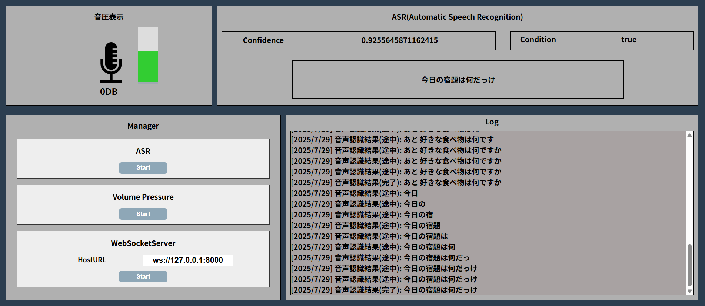

# Realtime ASR Server App

<p align="center">
  
</p>


リアルタイム音声認識とWebSocket通信による音声UIテストアプリです。  
ブラウザ上で音声を認識し、認識結果をサーバー（または他のアプリ）に送信します。

## 機能一覧

- ✅ Web Speech APIによるリアルタイム音声認識（Google Chrome推奨）
- ✅ 認識中のテキスト表示（中間結果対応）
- ✅ 音圧（音量）に基づく発話検出（しきい値でフィルタ）
- ✅ WebSocket経由で認識結果をJSON形式で送信
- ✅ 認識ログの表示と自動スクロール

## WebSocket連携
このアプリは音声認識結果をWebSocket経由で送信します。

### 🔸 送信されるデータ形式（JSON）

```json
{
  "confidence": "信頼度",
  "result": "認識内容",
  "isFinal": "認識完了かどうか"
}
```

取得データ例
```json
{
  "confidence": "0.95",
  "result": "こんにちは",
  "isFinal": "true"
}
```

## 画面構成
- 🎤 音量表示
- 🧠 音声認識結果表示
- 📡 WebSocket送信ログ
- ⚙️ 各種設定・状態表示

---
